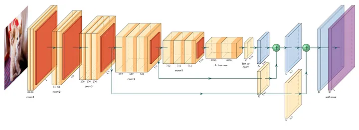

# Hey there 👋, I'm Khaled Mohamed



**Full Stack Developer** | **Data Enthusiast** | **Problem Solver**

I build things that matter. From scalable backend systems to data-driven solutions, I focus on writing clean, efficient code that solves real problems.

📍 Alexandria, Egypt 🇪🇬 | 💻 16 Total Commits

---

## About Me

Computer Science graduate from ALX Software Engineering. I'm passionate about building robust applications, analyzing data, and creating tools that make an impact. When I'm not coding, you'll find me learning new technologies and contributing to open source.

**What I do:**
- 🔧 Build scalable backend systems and APIs
- 📊 Work with data analysis and visualization
- 💻 Full-stack development
- 🚀 Ship features that users love

---

## Tech I Use

**Languages & Frameworks**
```
Python • JavaScript • C++ • Java • SQL • R
```

**Tools & Libraries**
```
TensorFlow • PyTorch • Django • React • Flask
Docker • Kubernetes • AWS • PostgreSQL • MongoDB
```

---

## Pinned Projects

### 🔗 [Check Out My Best Work](https://github.com/THEKINGSTAR?tab=repositories)

Explore my repositories to see what I've built:
- Full-stack applications
- Data analysis tools
- Open source contributions
- Side projects and experiments

---

## Let's Connect

- **GitHub:** [THEKINGSTAR](https://github.com/THEKINGSTAR)
- **LinkedIn:** [khaled-mohamed](https://www.linkedin.com/in/khaled-mohamed)
- **Email:** [Get in touch](mailto:khaled@example.com)

---

I'm always interested in collaborating on interesting projects and learning from other developers.

